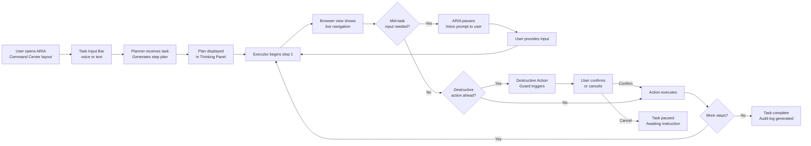
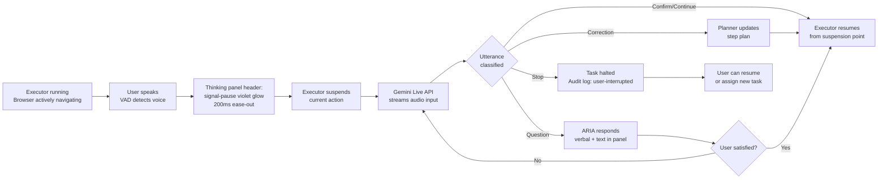
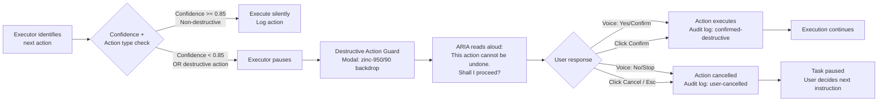

# UX Design Specification — gemini-hackathon (ARIA)

**Author:** Bahaa
**Date:** 2026-02-24

---

## Executive Summary

### Project Vision

ARIA (Adaptive Reasoning & Interaction Agent) is a voice-driven, multimodal UI navigator that executes web-based tasks in a live browser session on the user's behalf while keeping them visibly in control throughout. The defining UX thesis: users don't distrust AI agents because of capability gaps — they distrust them because they can't see where the agent is heading and can't stop it in time. ARIA solves visibility and control, and trust follows from that.

### Target Users

Six distinct personas share a common pattern: users who have a task they understand but that is tedious, error-prone, or time-consuming to execute manually. They range from operations managers delegating repetitive workflows, to students aggregating research, to retirees navigating complex forms with anxiety, to founders running QA under deadline pressure. The unifying UX need: they want to remain present and in control — not hand off and walk away.

### Key Design Challenges

1. **Two-surface layout** — The interface must show a live browser session, a real-time thinking panel, and voice controls simultaneously without overwhelming any user segment from Margaret to Ravi.
2. **Trust calibration at multiple confidence levels** — Confidence indicators and destructive action guards must build trust incrementally without adding friction that alienates power users.
3. **Voice state clarity** — With always-on VAD, the UI must unambiguously communicate ARIA's current state (listening / speaking / executing / paused / awaiting confirmation) at all times.
4. **Barge-in acknowledgment latency** — Sub-1s barge-in needs a matching instant visual confirmation so users never doubt whether ARIA heard them.

### Design Opportunities

1. **Thinking panel as the hero surface** — No competitor exposes internal reasoning. ARIA's live step feed can be made visually compelling — a "thought stream" that makes the agent feel intelligent and present, not mechanical.
2. **Voice as ambient presence** — An always-visible waveform or ambient pulse communicates ARIA's listening state continuously, making barge-in feel natural rather than exceptional.
3. **Confidence as design language** — A consistent color vocabulary (green / amber / red) applied to step items and confidence badges makes the thinking panel instantly scannable for both novice and power users.

---

## Core User Experience

### Defining Experience

The primary interaction loop is: speak a task → watch ARIA think and act in real-time → intervene by voice if needed → review the result. The single most critical interaction is the voice interruption moment — when a user says "wait" mid-execution and ARIA visibly, instantly stops. That moment proves the entire product thesis. Every other UI decision serves to make that moment feel natural and inevitable.

### Platform Strategy

- **Platform:** Desktop web (Next.js + Firebase Hosting), Chrome 120+ / Edge 120+ primary
- **Input modality:** Voice-primary with text fallback; mouse + keyboard for UI interactions
- **Viewport:** Minimum 1280px wide — horizontal layout required to accommodate thinking panel + live browser view side-by-side
- **Offline:** Not supported — requires live GCP connection to Gemini APIs at all times
- **Mobile:** Out of scope for MVP

### Effortless Interactions

The following must require zero user thought or friction:
- **Starting a task** — speak naturally, no configuration, no mode selection
- **Interrupting ARIA** — just speak; no button press, no mode switch, always-on VAD
- **Confirming or declining** — say "yes" or "no" to destructive action guards
- **Following along** — the thinking panel and voice narration update automatically; users never need to ask "what's happening?"
- **Reviewing results** — the audit log populates in real-time; no export step required to see what happened

### Critical Success Moments

1. **The barge-in moment** — User says "wait" → ARIA stops within 1 second → thinking panel shows "Paused — listening" → user feels they are in control. If this interaction fails, the product thesis fails with it.
2. **The first completed step** — The first browser action executes and the thinking panel updates simultaneously. This is when users believe, for the first time, that ARIA is real.
3. **The destructive action guard** — Before a form submits, ARIA speaks aloud and a confirmation modal appears. The user feels protected, not surprised. Zero silent destructive actions is non-negotiable.
4. **The audit log reveal** — At session end, a complete timestamped record with annotated screenshots appears. The user feels professional, documented, and safe.

### Experience Principles

1. **Transparency over efficiency** — Always show what ARIA is doing and why, even if it adds a beat of time. A user who understands is a user who trusts.
2. **Voice is primary, UI is parallel** — Every critical state is communicated in both voice and visually, simultaneously. Neither channel should be required alone.
3. **Control is always one word away** — The user should never feel trapped mid-execution. Barge-in feels like a natural reflex, not a special mode or escape hatch.
4. **Confidence is legible at a glance** — The thinking panel is readable in under 2 seconds without reading text — color, icons, and motion carry meaning first.
5. **Progressive trust** — First-time users (Margaret) and power users (Ravi) experience the same UI, but experts can move faster. Never force power users to wait for beginner scaffolding.

---

## Desired Emotional Response

### Primary Emotional Goals

The primary emotional state ARIA must create is **calm confidence** — not the excitement of a magic trick, but the quiet satisfaction of watching a competent colleague handle something reliably while you remain present and in control. Users should feel like a director, not a passenger.

### Emotional Journey Mapping

| Stage | Desired Feeling | Trigger |
|---|---|---|
| First task assignment | Curious, hopeful | Simple voice input with immediate response |
| Step plan appears | Reassured | Visible ordered plan before any action starts |
| First browser action executes | Impressed, believing | Thinking panel and browser move in sync |
| Mid-execution barge-in | Empowered | ARIA stops instantly on voice; panel acknowledgment |
| Destructive action guard appears | Protected, respected | Voice + visual confirmation before irreversible action |
| Task completes | Relieved, satisfied | "Done" state + complete audit log visible |
| Reviewing audit log | Confident, documented | Timestamped record with annotated screenshots |

### Micro-Emotions

- **Reassurance over surprise** — Users should never be startled. State transitions are always announced in advance (voice + visual).
- **Competence over magic** — The thinking panel shows the work. ARIA looks thorough, not mysterious.
- **Trust through evidence** — Confidence scores and the audit log give users proof, not promises.
- **Control without effort** — Barge-in is always active. Users feel powerful without pressing anything.

### Emotions to Avoid

- **Anxiety** — "Is it about to do something I didn't want?" → Mitigated by destructive action guard and pre-execution step plan
- **Helplessness** — "How do I stop this?" → Mitigated by always-visible barge-in state and interrupt button
- **Confusion** — "What is it doing right now?" → Mitigated by thinking panel + live voice narration
- **Distrust** — "Did it actually do that correctly?" → Mitigated by annotated screenshots and confidence scoring in audit log

### Design Implications

| Desired Emotion | UX Design Approach |
|---|---|
| Calm confidence | Steady pacing in thinking panel; no jarring transitions; consistent, measured voice narration tone |
| Safety / protection | Destructive action guard mandatory in both voice and visual simultaneously; never dismissible by inaction |
| In control | Barge-in state always visible; ARIA's "Paused — listening" acknowledgment instantaneous and prominent |
| Trust in results | Audit log is complete, timestamped, screenshot-annotated — evidence the user can reference or share |
| Competence (not magic) | Step plan shown in full before execution begins; Planner's reasoning visible, never hidden |
| Relief / freedom | Task completes cleanly; "Done" state clear; no post-task required cleanup or manual verification |

### Emotional Design Principles

1. **Safety is non-negotiable** — Any design that makes users feel unsafe or unprotected is a failure, regardless of efficiency gain.
2. **Announce before you act** — Every significant state change (plan ready, step starting, confirmation needed, task done) is communicated before it happens, not after.
3. **Evidence builds trust** — Show the work. Confidence scores, annotated screenshots, and the full audit log are not optional features — they are the emotional foundation of the product.
4. **Calm is the brand** — ARIA's visual language, pacing, and voice tone should consistently signal competence and steadiness, never urgency or drama.

---

## UX Pattern Analysis & Inspiration

### Inspiring Products Analysis

| Product | Relevant UX Strength | Application to ARIA |
|---|---|---|
| **Perplexity AI** | Live reasoning state visibility — "Searching → Reading → Composing" before response | Thinking panel step progression; Planner decomposition animation |
| **Linear** | Extreme information density rendered calm through typography and subtle color systems | Thinking panel step items — information-rich but visually quiet |
| **Figma (multiplayer)** | Ambient live state indicators (cursors, presence) that show activity without interrupting focus | Always-visible voice waveform; active step highlight pulse |
| **Siri / Google Assistant** | Barge-in waveform acknowledgment — instant visual feedback when speech is detected | VAD-triggered waveform animation before processing begins |

### Transferable UX Patterns

**Reasoning Transparency Pattern (Perplexity):**
Disclose reasoning progressively — step-by-step as it happens, never upfront as a wall of text. Each step appears as it becomes relevant, not as a batch dump.

**Density-with-Calm Pattern (Linear):**
Rich step items (action type, confidence, status icon) can coexist without visual noise if typography hierarchy and a restrained color system carry the weight. Color means something; decoration is absent.

**Ambient Presence Pattern (Figma):**
Always-on state indicators (voice waveform, active step highlight) should live permanently in the layout — not appear on demand. Presence is continuous, not event-triggered.

**Pre-Processing Acknowledgment Pattern (Siri/Google):**
The moment VAD fires, animate the microphone/waveform before any processing result returns. Users need confirmation they were heard in under 200ms — before ARIA has paused execution.

### Anti-Patterns to Avoid

| Anti-Pattern | Reason to Avoid |
|---|---|
| Voice mode entry/exit toggle | Destroys the always-on barge-in model; forces users to pre-plan when to speak |
| Progress bar without step detail | Shows time passing, not meaning — increases anxiety without building trust |
| Silent execution | No narration + no panel updates = users feel abandoned mid-task |
| Text-only destructive confirmation | Easy to overlook; voice + visual simultaneously is the minimum |
| Hidden confidence scores | If the model is uncertain, users must know — hiding uncertainty destroys trust after the first failure |

### Design Inspiration Strategy

**Adopt directly:**
- Progressive reasoning disclosure (Perplexity) → thinking panel step-by-step reveal
- Pre-processing barge-in waveform (Siri/Google) → VAD-triggered animation before pause confirmation

**Adapt:**
- Linear's density-with-calm system → apply to step items with ARIA's confidence color vocabulary (green/amber/red)
- Figma's ambient presence model → voice state waveform always visible in layout sidebar, not in a modal or overlay

**Avoid:**
- Voice mode toggle pattern (ChatGPT/Siri app) → ARIA's VAD is always-on; no mode boundary exists
- Silent execution (Atlas/Skyvern) → narration is a core differentiator, not a feature flag

---

## Design System Foundation

### Design System Choice

**Selected approach:** Tailwind CSS + shadcn/ui (themeable system) with ARIA-specific custom components

shadcn/ui is already specified in the architecture. This step confirms and extends it as the full design system foundation, not just a component library.

| Layer | Technology | Purpose |
|---|---|---|
| Utility styling | Tailwind CSS v3 | All layout, spacing, typography, and color application |
| Primitive components | shadcn/ui (Radix UI base) | Button, Card, Badge, Dialog, Toast, Separator, ScrollArea |
| Custom components | Hand-built with Tailwind | VoiceWaveform, StepItem, ConfidenceBadge, ScreenshotViewer, BargeInPulse |
| Theme | CSS custom properties | Dark-first; semantic confidence color tokens |

### Rationale for Selection

- **Speed:** shadcn/ui provides all structural primitives (Button, Card, Dialog, Scroll, Toast) with zero build time — essential for the 21-day sprint
- **Dark-first:** shadcn/ui's CSS variable token system supports dark mode natively; ARIA's dense execution interface benefits from a dark theme to reduce eye strain during extended use
- **Accessibility:** Built on Radix UI — keyboard navigation and ARIA attributes are built in, not retrofitted
- **Visual freedom:** Tailwind's utility approach allows full divergence from Material/Ant aesthetics — ARIA can look distinctive while using proven primitives underneath
- **Hackathon-appropriate:** No custom design system overhead; no Storybook, no token pipeline — just CSS variables and Tailwind config

### Implementation Approach

**Phase 1 — Base tokens (Day 1):**
- Extend `tailwind.config.ts` with ARIA semantic color tokens
- Configure shadcn/ui dark theme via `globals.css` CSS variables
- Set Geist + Geist Mono as font stack

**Phase 2 — Primitive components (Days 1–3):**
- Install shadcn/ui components as needed: `button`, `card`, `badge`, `dialog`, `scroll-area`, `separator`, `toast`
- No customization beyond theme tokens at this stage

**Phase 3 — Custom components (Days 3–10):**
- `VoiceWaveform` — animated amplitude bars, state-driven color (listening / speaking / idle)
- `StepItem` — step index, action description, status icon, confidence badge, expandable screenshot
- `ConfidenceBadge` — color-coded pill (high / mid / low) using semantic tokens
- `BargeInPulse` — ripple animation triggered on VAD detection, composable with VoiceWaveform
- `ScreenshotViewer` — annotated screenshot with bounding box overlays

### Customization Strategy

**Semantic Color Tokens (dark theme):**

| Token | Value | Usage |
|---|---|---|
| `--color-step-active` | `#3B82F6` (Electric Blue) | Currently executing step highlight |
| `--color-confidence-high` | `#10B981` (Emerald) | Confidence ≥ 80% |
| `--color-confidence-mid` | `#F59E0B` (Amber) | Confidence 50–79% |
| `--color-confidence-low` | `#F43F5E` (Rose) | Confidence < 50% |
| `--color-surface` | `#18181B` (Zinc 900) | Main panel backgrounds |
| `--color-surface-raised` | `#27272A` (Zinc 800) | Step item cards, raised surfaces |
| `--color-border` | `#3F3F46` (Zinc 700) | Separators, input borders |

**Typography:**
- UI text: Geist Sans (Next.js default) — clean, modern, highly legible at small sizes
- Step descriptions / action text: Geist Mono — reinforces technical precision without being cold
- Scale: 12px step metadata → 14px primary UI → 16px task input → 20px section headers

---

## Defining Core Experience

### Defining Experience

ARIA's defining experience: **the user speaks while something is happening — and ARIA listens, stops, and adapts.**

This is the moment that makes ARIA a collaborator rather than a script. It is the interaction no competitor can replicate, and the one scene that validates all three hackathon judging dimensions simultaneously.

> "Just speak anytime to interrupt" — this single onboarding cue is the entire UX contract.

### User Mental Model

Users arrive with a learned mental model from every automation tool they've used: *assign task → wait → hope it worked*. They assume delegation means abandonment — that pressing Start means surrendering control.

ARIA must replace **"delegation = abandonment"** with **"delegation = collaboration."**

The thinking panel delivers the first half of this shift (visibility). The barge-in delivers the second half (control). Together they constitute a new mental model for AI task execution.

**What users love about existing solutions:** tasks complete without manual steps.
**What users hate:** can't stop mid-way, don't know what's happening, can't trust the result without verification.

ARIA addresses all three pain points simultaneously.

### Success Criteria

| Criterion | Observable Signal |
|---|---|
| User feels heard instantly | Waveform pulses within 200ms of speech detection |
| ARIA stops before doubt sets in | Execution halts within 1 second of utterance |
| ARIA confirms it understood | Voice response: "Got it — I heard you. What would you like to do?" |
| User can course-correct naturally | New instruction → plan updates → execution resumes from current browser state |
| No restart required | Same session continues from where execution paused |

### Novel UX Patterns

| Interaction | Pattern Type | Teaching Approach |
|---|---|---|
| Voice task assignment | Established (chat-like) | None needed — familiar paradigm |
| Thinking panel step progression | Novel (Perplexity-inspired) | Self-evidently legible by design |
| Always-on VAD barge-in | Novel | Single onboarding cue: "Just speak anytime to interrupt" |
| Destructive action guard (voice + visual simultaneously) | Established concept, novel dual-channel delivery | Instinctive — no teaching needed |
| Audit log as live real-time record | Established (activity feed) | Familiar metaphor — no teaching needed |

The only novel pattern requiring explicit user education is always-on VAD. One visible label in the voice indicator — "Always listening" — is sufficient to set the expectation.

### Experience Mechanics

**The barge-in flow — step by step:**

1. **Initiation:** ARIA is mid-execution. The user speaks without pressing anything — no mode, no button.
2. **Immediate acknowledgment (< 200ms):** The voice waveform pulses and shifts color to "listening" state. Visual confirmation fires before any processing completes.
3. **Execution halt (< 1s):** The Executor stops after the current action completes. The active step in the thinking panel shows "⏸ Paused." No further browser action occurs.
4. **Re-listen and confirm:** Gemini Live VAD captures the full utterance. ARIA responds in voice: *"Got it — stopping. What would you like to do?"*
5. **Plan adaptation:** The Planner receives current browser state + new instruction and produces a revised step plan. The thinking panel updates to show the new plan.
6. **Seamless resume:** Execution continues from the current browser state — no page reload, no session restart, no lost progress.

**The task assignment flow — step by step:**

1. **Initiation:** User clicks mic or types in task input field.
2. **Capture:** Voice or text task is received. Thinking panel shows "Planning..." with a subtle pulse.
3. **Plan reveal:** Planner returns ordered step plan. Steps appear in the thinking panel one by one with a brief stagger animation.
4. **Execution begins:** First step highlights in blue. Browser action starts. Voice narration begins: *"Starting with..."*
5. **Continuous feedback:** Each completed step gets a green checkmark. Active step pulses blue. Next step is visible but muted.
6. **Task complete:** Final step completes. Voice: *"Done. Here's what I did."* Audit log fully visible.

---

## Visual Design Foundation

### Color System

**Design philosophy:** Color serves signal before aesthetics. Every color has a functional purpose and is never used decoratively.

**Surface palette (dark theme):**

| Token | Hex | Tailwind | Usage |
|---|---|---|---|
| `bg-base` | `#09090B` | `zinc-950` | Full page background |
| `bg-surface` | `#18181B` | `zinc-900` | Panel backgrounds |
| `bg-raised` | `#27272A` | `zinc-800` | Step item cards, raised surfaces |
| `bg-muted` | `#3F3F46` | `zinc-700` | Hover states, input fills |
| `border` | `#52525B` | `zinc-600` | Dividers, outlines |

**Text hierarchy:**

| Token | Hex | Usage |
|---|---|---|
| `text-primary` | `#FAFAFA` | Headings, active content, task text |
| `text-secondary` | `#A1A1AA` | Metadata, labels, muted descriptions |
| `text-disabled` | `#52525B` | Inactive steps, placeholder text |

**Semantic signal palette:**

| Token | Hex | Usage |
|---|---|---|
| `signal-active` | `#3B82F6` (Blue) | Currently executing step; active voice state |
| `signal-success` | `#10B981` (Emerald) | Completed steps; confidence ≥ 80% |
| `signal-warning` | `#F59E0B` (Amber) | Confidence 50–79%; requires attention |
| `signal-danger` | `#F43F5E` (Rose) | Confidence < 50%; destructive action guard |
| `signal-pause` | `#A78BFA` (Violet) | Barge-in / paused state — distinct from all other signals |

### Typography System

| Role | Size | Weight | Font Family |
|---|---|---|---|
| Section header | 20px / 1.25rem | 600 | Geist Sans |
| Step description | 14px / 0.875rem | 400 | Geist Mono |
| Task input | 16px / 1rem | 400 | Geist Sans |
| UI labels / body | 14px / 0.875rem | 400 | Geist Sans |
| Metadata / timestamps | 12px / 0.75rem | 400 | Geist Sans |
| Confidence badge | 11px / 0.688rem | 600 | Geist Sans |

Geist Mono is used exclusively for step action descriptions, URLs, and technical command output — reinforcing the "precise and technical" register without applying it globally.

### Spacing & Layout Foundation

**Base unit:** 4px. All spacing values are multiples of 4.

| Context | Value |
|---|---|
| Step item padding | `12px 16px` (3u vertical / 4u horizontal) |
| Gap between step items | `8px` |
| Panel internal padding | `16px` |
| Panel-to-panel gap | `16px` |
| Page content max-width | `1440px` |

**Primary layout (1280px+ viewport):**

```
┌──────────────────────────────────┬────────────────────┐
│  Browser View (flex-grow)        │  Thinking Panel    │
│                                  │  (400px fixed)     │
│                                  │  [Step list]       │
│                                  │  [Voice state]     │
│                                  │  [Audit log]       │
└──────────────────────────────────┴────────────────────┘
│  Task Input Bar (full-width, fixed bottom, 64px height)│
└────────────────────────────────────────────────────────┘
```

The thinking panel is right-anchored and fixed-width. The browser view fills all remaining horizontal space. The task input bar is always visible at the bottom — lowest z-index interruption priority.

### Accessibility Considerations

- All text/background combinations meet WCAG AA contrast (4.5:1 minimum): `text-secondary` (`#A1A1AA`) on `bg-surface` (`#18181B`) = 5.9:1 ✅
- Color is never the sole signal carrier: step status uses icon + color; confidence uses text label + color badge
- Focus rings: `ring-2 ring-signal-active ring-offset-2` — visible keyboard navigation path throughout
- Font sizes: minimum 12px; no content below 11px (badge labels only)
- Destructive action guard modal: meets color contrast + has explicit text label — never icon-only


---

## Design Direction Decision

### Design Directions Explored

Six directions were prototyped in an interactive HTML showcase (`ux-design-directions.html`) and evaluated against six weighted criteria:

| # | Direction | Character | Layout |
|---|---|---|---|
| 1 | Command Center | Browser dominant, thinking panel right | Browser left (flex-grow) + 400px panel right + 64px task bar bottom |
| 2 | Split Focus | Trust-first, panel left | 320px panel left + browser right |
| 3 | Immersive Overlay | Demo wow factor | Full-viewport browser + translucent floating panel |
| 4 | Terminal | Developer/power-user | Monospace log-style, navy palette |
| 5 | Card-First | Novice-accessible | Collapsible step cards with screenshot previews |
| 6 | Focus Mode | Cleanest chrome | Header breadcrumb + tabbed sidebar |

**Evaluation criteria:** layout intuitiveness, voice state visibility, barge-in readiness, confidence signal legibility, demo camera-readiness, novice accessibility

### Competitor UI Benchmarking

Direct screenshots of Manus and Browser-Use Cloud were reviewed (Feb 24, 2026):

| Product | Layout pattern | Browser visible? | Reasoning visible? | Voice? |
|---|---|---|---|---|
| Manus | Centered chat thread + collapsed step accordion + inline frozen thumbnail | No (tiny snapshot only) | No (flat text log) | Mic icon in input only |
| Browser-Use Cloud | ChatGPT-paradigm centered input + skill marketplace | No (headless) | No | No |

**Key market finding:** Every competitor has converged on the chat paradigm. No competitor shows a live browser view, semantic step-state colors, per-step confidence badges, or an always-on voice affordance.

### Chosen Direction: Command Center (Direction 1)

Direction 1 selected as the primary layout with one borrowed pattern from Manus's live session.

**Layout specification:**
```
+----------------------------------+--------------------+
|  Browser View (flex-grow)        |  Thinking Panel    |
|  - live Playwright iframe        |  (400px fixed)     |
|  - executing step overlay badge  |  [Step tree]       |
|  - element highlight on hover    |  [Confidence Bdgs] |
|                                  |  [Voice waveform]  |
|                                  |  [Audit log tab]   |
+----------------------------------+--------------------+
|  Task Input Bar (full-width fixed bottom, 64px)        |
+--------------------------------------------------------+
```

**Borrowed from Manus:** Expandable/collapsible sub-step tree inside the thinking panel. ARIA adds confidence scoring and voice reactivity on top.

### Design Rationale

| Criterion | Score | Why it wins |
|---|---|---|
| Layout intuitiveness | 5/5 | Browser-dominant mirrors how users think about the task |
| Voice state visibility | 5/5 | Waveform always in thinking panel header - never hidden |
| Barge-in readiness | 5/5 | Voice waveform + violet barge-in signal = interrupt affordance is structural |
| Confidence signal legibility | 5/5 | Fixed-width thinking panel provides dedicated space for badge + label per step |
| Demo camera-readiness | 4/5 | Live browser + colored signal states = visually dynamic on screen recording |
| Novice accessibility | 4/5 | Browser view gives spatial context; thinking panel gives textual guidance |

**Differentiators visible vs. competitors:**
1. Live browser is actually visible - judges see ARIA working in real time
2. Semantic signal colors (blue executing / violet barge-in / amber warning / green done)
3. Per-step confidence badges - no competitor surfaces this
4. Always-present voice waveform - barge-in is a structural affordance, not a hidden gesture

### Implementation Approach

- **Browser panel:** Playwright-controlled Chromium screenshot stream via WebSocket at 30fps
- **Thinking panel:** React component subscribing to ADK observability stream; steps as live-updating list with signal-* color classes
- **Voice waveform:** Web Audio API AnalyserNode to Canvas renderer in thinking panel header; always active
- **Task input bar:** Fixed bottom-0 full-width bar with text input + mic button + active task status pill; 64px height
- **Responsive breakpoint:** Below 1280px, thinking panel collapses to bottom sheet
- **State transition:** signal-executing to signal-pause triggers thinking panel header glow animation (200ms ease-out)


---

## User Journey Flows

The PRD documents six personas but confirms a single underlying capability pattern: all six are served by the same mechanics  task assignment, live execution with thinking panel, voice barge-in, destructive action guard, and audit log. Three universal interaction flows cover every journey.

### Flow 1  Core Task Execution

*Entry to completion  the spine every session follows.*
**Personas:** All six (Sara, James, Margaret, Ravi, Leila, Chris)



**Entry points:** Voice via always-on waveform mic  Text in task input bar
**Success signal:** Green `signal-done` badge on all steps + audit log tab unlocks with screenshot count
**Key UX moment:** Browser moves and thinking panel updates simultaneously  users see coordination, not just logging

---

### Flow 2  Voice Barge-in

*User speaks while agent is executing  agent stops, listens, adapts.*
**Personas:** James (correction), Ravi (stop), Sara (implicit), Leila



**Barge-in affordance:** VAD waveform always active in thinking panel  no button required to interrupt
**Visual signal:** `signal-pause` violet replaces `signal-active` blue instantly  the color change IS the acknowledgment
**Emotional goal:** User feels heard within 200ms before ARIA finishes processing

---

### Flow 3  Destructive Action Guard

*ARIA detects irreversible action and requires explicit human confirmation.*
**Personas:** Sara (submit), Margaret (submit), Leila (purchase), Chris (publish)



**Guard triggers:** Form submit, purchase/payment, publish/post, delete, send email/message, file overwrite
**Guard does NOT trigger:** Navigation, reading, searching, filling non-submit fields, scrolling
**Emotional goal:** Users know ARIA will never silently do something irreversible

---

### Journey Patterns

| Pattern | Description | Flows |
|---|---|---|
| **Suspend-Resume** | Executor suspends at any step boundary and resumes from the same point without re-executing prior steps | Barge-in (Flow 2), Mid-task input (Flow 1), Guard cancel (Flow 3) |
| **Voice-first confirmation** | Every pause that requires user input is voiced aloud AND shown in the thinking panel  dual channel reduces missed prompts | Guard (Flow 3), Mid-task input (Flow 1) |
| **Audit point injection** | Every state transition (plan-start, step-complete, user-interrupted, guard-confirmed, guard-cancelled) writes a timestamped audit record | All flows |

### Flow Optimization Principles

1. **Zero idle time on the happy path**  high confidence + non-destructive action = ARIA moves without pausing
2. **Every pause has an obvious resume**  thinking panel always shows what ARIA is waiting for and how to provide it
3. **Barge-in suspends, not stops**  voice interruption is a modification unless user explicitly says "stop"
4. **Audit log is a first-class output**  not a debug tool; it is what Sara hands her intern, what Ravi pastes into the launch ticket, what Margaret screenshots for her records

---

## Component Strategy

### Design System Components (shadcn/ui -- use as-is)

| Component | Usage in ARIA |
|---|---|
| `Button` | Confirm/Cancel in destructive guard modal, task input submit |
| `Badge` | Base for ConfidenceBadge custom component |
| `Dialog` | Destructive Action Guard modal shell |
| `ScrollArea` | Thinking panel step list, audit log scroll container |
| `Separator` | Panel dividers, step section breaks |
| `Toast` / `Sonner` | Non-blocking status notifications (task complete, error) |
| `Tooltip` | Confidence score explainer on hover |
| `Tabs` | Thinking panel tab switcher (Steps / Audit Log / Screenshots) |
| `Skeleton` | Loading state for BrowserPanel stream warmup |
| `ResizablePanelGroup` + `ResizablePanel` | Browser/thinking panel split -- use built-in shadcn resizable |

### Custom Components

Ten custom components cover every surface in the Command Center layout. All built with Tailwind utilities and ARIA CSS variable tokens -- no raw color values.

#### 1. VoiceWaveform
**Purpose:** Communicates ARIA audio state continuously -- always visible in the thinking panel header.

| State | Visual | Color token |
|---|---|---|
| idle | 5 flat bars, static | zinc-600 |
| listening | Bars animate to audio amplitude | signal-active blue |
| barge-in | Rapid pulse + glow ring | signal-pause violet |
| speaking | Smooth sinusoidal movement | zinc-400 |

**Anatomy:** 5 vertical bars, height driven by Web Audio API AnalyserNode. Canvas renderer with CSS animation fallback.
**Accessibility:** aria-label="Voice activity indicator", role="img", aria-live="polite" for state changes.

---

#### 2. StepItem
**Purpose:** Primary repeating unit of the thinking panel -- represents one planned execution step.

**States:** pending (muted) / executing (blue highlight + pulse) / done (green) / paused (violet) / failed (rose)
**Variants:** compact (no thumbnail) / expanded (screenshot visible)
**Props:** stepIndex, action, url?, status, confidence, screenshot?, isExpanded
**Accessibility:** role="listitem", status via aria-label, not color alone.

---

#### 3. ConfidenceBadge
**Purpose:** Inline confidence score -- always text label + color, never color alone.

| Confidence | Label | Token |
|---|---|---|
| >= 80% | HIGH 94% | signal-success emerald |
| 50-79% | MID 67% | signal-warning amber |
| < 50% | LOW 31% | signal-danger rose |

**Extends:** shadcn Badge with variant prop mapping to signal tokens.
**Accessibility:** aria-label="Confidence score: high, 94 percent".

---

#### 4. AgentStatusPill
**Purpose:** Single-source-of-truth state indicator -- used in browser panel overlay, thinking panel header, and task input bar.

| State | Label | Token |
|---|---|---|
| idle | Ready | zinc-500 |
| planning | Planning... | zinc-400 animate-pulse |
| executing | Executing - Step 3 of 7 | signal-active blue |
| paused | Paused -- listening | signal-pause violet |
| guard | Confirmation needed | signal-danger rose |
| done | Done | signal-success emerald |

**Props:** state, stepCurrent?, stepTotal?

---

#### 5. TaskInputBar
**Purpose:** Fixed bottom bar -- primary user entry point for every flow. Has its own state machine.

| State | Visual | Input active? |
|---|---|---|
| idle | Placeholder + mic button + disabled submit | Yes |
| recording | Waveform fills input area, Listening label | No |
| executing | AgentStatusPill + stop button | No |
| paused | Re-enabled input for follow-up instruction | Yes |

**Anatomy:** AgentStatusPill left / Input or VoiceWaveform center / mic+stop Button + submit Button right.

---

#### 6. BrowserPanel
**Purpose:** Hosts the live Playwright browser screenshot stream with execution context overlays.

**States:** idle (Skeleton) / executing (live MJPEG stream + blue AgentStatusPill overlay) / paused (violet tint) / guard (rose tint, Dialog above)
**Implementation:** img tag refreshing from WebSocket MJPEG stream; SVG overlay layer for element bounding boxes.

---

#### 7. AuditLogEntry
**Purpose:** Repeating item in the Audit Log tab -- distinct from StepItem; shows event type, timestamp, and actor (ARIA vs. user).

**Props:** timestamp, eventType, description, actor (aria or user), screenshotIndex?
**Event types:** plan-start / step-complete / user-interrupted / guard-confirmed / guard-cancelled / task-complete

---

#### 8. MidTaskInputPrompt
**Purpose:** Inline request inside the thinking panel when ARIA needs user-provided data mid-execution. Not a modal -- keeps the browser panel visible.

**Appears:** As a high-priority item inside the thinking panel ScrollArea, above pending steps.
**Props:** prompt, inputType (text, file, or voice), onProvide, onSkip

---

#### 9. BargeInPulse
**Purpose:** Immediate visual acknowledgment (under 200ms) of voice detection -- fires before server processing completes.
**Behavior:** Concentric ring expansion from VoiceWaveform. Lasts 600ms. Highest z-index.
**Composability:** Wraps VoiceWaveform; receives triggered boolean prop.

---

#### 10. ScreenshotViewer
**Purpose:** Expanded annotated screenshot in audit log or step item -- bounding box overlays, step label, timestamp, zoom.
**Phase:** 3 (polish) -- audit log functions without it in earlier phases.

---

### Component Implementation Strategy

**Composition principle:** Custom components compose shadcn primitives wherever possible. ConfidenceBadge extends Badge. StepItem uses shadcn Tooltip internally. BrowserPanel uses shadcn Skeleton for loading. TaskInputBar uses shadcn Button and Input.

**Token discipline:** No raw color values in any component -- only CSS variable references like var(--color-signal-active) so theme changes propagate automatically.

**Layout:** Use shadcn ResizablePanelGroup for the browser/thinking panel split -- gives users a drag handle with zero custom code.

### Implementation Roadmap

**Phase 1 -- Critical path (Days 1-5):**
- VoiceWaveform -- barge-in demo requires this visually
- StepItem -- thinking panel requires this to render
- ConfidenceBadge -- step items require this
- AgentStatusPill -- browser panel, thinking panel header, and task bar all use it
- TaskInputBar -- primary user entry point for every flow

**Phase 2 -- Core experience (Days 5-10):**
- BrowserPanel -- live browser stream display
- AuditLogEntry -- audit log tab (Sara, Ravi, Margaret demo moments)
- MidTaskInputPrompt -- mid-task data collection (Sara, Margaret journeys)
- shadcn Dialog configured for Destructive Action Guard
- shadcn Tabs for Steps / Audit Log / Screenshots panels

**Phase 3 -- Polish (Days 10-18):**
- BargeInPulse -- visual delight layer
- ScreenshotViewer -- expanded audit log screenshots
- shadcn Sonner for non-blocking notifications

---

## UX Consistency Patterns

### Button Hierarchy

ARIA follows a strict 3-tier action hierarchy using shadcn/ui Button variants mapped to semantic weight.

**Tier 1 -- Primary Actions** (`variant="default"`, sky-500 fill)
**When to Use:** Single most-important action per view. One per screen region maximum.
**Examples:** "Start Task" in TaskInputBar, "Confirm" in Destructive Action Guard dialog.
**Behavior:** Full hover lift (translateY -1px), active press (scale 0.98), 150ms ease-out.
**Accessibility:** `aria-label` required when icon-only. Always focusable, keyboard Enter/Space activation.
**Disabled State:** 40% opacity, `cursor-not-allowed`, `aria-disabled="true"` -- never `disabled` attribute (preserves focus).

**Tier 2 -- Secondary Actions** (`variant="outline"`, border + ghost text)
**When to Use:** Confirmatory alternatives, cancel paths, supplemental navigation.
**Examples:** "Pause Task", "View Full Log", panel tab switches.
**Behavior:** Border color transitions on hover (border-sky-400), no lift effect.
**Accessibility:** Grouped secondary actions use `role="group"` with `aria-label`.

**Tier 3 -- Ghost/Destructive Actions** (`variant="ghost"` or `variant="destructive"`)
**When to Use:** Ghost for low-weight icon actions (copy, collapse). Destructive (rose-600) only for irreversible operations.
**Destructive Rule:** Always requires a confirmation Dialog before execution -- never fires inline. See Destructive Action Guard pattern in User Journey Flows.
**Accessibility:** Destructive buttons carry `aria-keyshortcuts` warning in tooltip.

**Icon Buttons:** 44x44px minimum touch target (even when visually 20px icon). Always paired with `Tooltip` showing label. `aria-label` matches tooltip text exactly.

---

### Feedback Patterns

ARIA uses a layered feedback system: **inline** for field-level, **toast** for system events, **panel** for agent state.

#### Success Feedback
**Trigger:** Task completed, action confirmed, data saved.
**Component:** Sonner toast, `variant="success"`, signal-success emerald, 4s auto-dismiss.
**Copy Pattern:** Past-tense verb + result noun. *"Task completed -- 14 steps executed."*
**No interruption rule:** Success toasts never block the task bar or thinking panel. Position: bottom-left, above TaskInputBar (72px offset).
**Agent State:** AgentStatusPill transitions to `idle` state with momentary emerald pulse (800ms -> back to default).

#### Error Feedback
**Trigger:** Task failed, network error, agent cannot proceed.
**Component:** Sonner toast `variant="error"` + inline `MidTaskInputPrompt` if recovery requires user input.
**Copy Pattern:** What happened + what to do. *"Connection lost -- click Retry or start a new task."*
**Persist rule:** Error toasts do NOT auto-dismiss. User must explicitly close or act.
**Agent State:** AgentStatusPill transitions to `error` state (rose-500). StepItem for failed step shows `failed` state with error detail expandable.
**Recovery:** Always provide one clear escape hatch -- Retry button in toast OR dismiss to TaskInputBar.

#### Warning Feedback
**Trigger:** Destructive action pending, low confidence result, resource limit approaching.
**Component:** shadcn Dialog for destructive warnings (blocks action). Sonner `variant="warning"` (amber) for informational warnings.
**Blocking vs. Non-blocking:** Actions that delete, navigate away mid-task, or override agent decisions -> blocking Dialog. All others -> non-blocking toast.
**ConfidenceBadge:** LOW tier (< 50%, rose) always accompanies a warning Tooltip explaining uncertainty.

#### Informational Feedback
**Trigger:** Background activity, progress updates, non-critical state changes.
**Component:** Sonner default toast, 3s auto-dismiss. AuditLogEntry for persistent record.
**Mid-task updates:** Appended as StepItems in thinking panel -- never interrupt task bar focus.

---

### Form Patterns

ARIA has two form contexts: **TaskInputBar** (primary, always visible) and **MidTaskInputPrompt** (inline, agent-initiated).

#### TaskInputBar Patterns
**States:** idle -> recording (voice) / typing (keyboard) -> submitting -> executing.
**Input validation:** Real-time character count if > 200 chars (soft limit indicator, amber). Hard limit 500 chars with inline counter turning rose.
**Empty submit prevention:** Submit action disabled + shake animation (x-axis, 4px, 2 cycles, 200ms) if input empty.
**Voice toggle:** Pressing mic icon mid-type appends voice transcript to existing text. Never replaces.
**Placeholder text:** Contextual -- changes based on AgentStatus. Idle: *"Describe a task..."* | Paused: *"Resume or change direction..."* | Error: *"Try a different approach..."*

#### MidTaskInputPrompt Patterns
**Trigger:** Agent needs structured data mid-task (Sara's form fill, Margaret's confirmation).
**Placement:** Inline in thinking panel below current StepItem -- NOT a modal overlay.
**Required fields:** Clearly marked with rose asterisk + `aria-required`. Never more than 3 fields per prompt (complexity triage).
**Cancel path:** Always available. Cancelling mid-task prompt resumes agent with a `[USER_SKIPPED]` annotation in AuditLog.
**Timeout:** 60s inactivity -> gentle pulse animation on prompt + toast nudge. 120s -> agent pauses and prompts again.

#### Validation Rules (Universal)
- Validate on blur, not on keystroke (reduces anxiety -- Sara/Leila personas).
- Error messages: below field, signal-danger rose, `role="alert"`, icon + text (never color alone).
- Success state: subtle emerald border only -- no distracting checkmark animation.

---

### Navigation Patterns

ARIA's Command Center is a single-page layout. Navigation is state-driven, not route-driven.

#### Panel Navigation (Thinking Panel Tabs)
**Tabs:** Steps | Audit Log | Screenshots (shadcn Tabs, `variant="underline"`).
**Default:** Steps tab active, auto-advances to Audit Log when agent completes (if Ravi/James persona detected via task type heuristic).
**Keyboard:** Arrow keys navigate tabs. Tab key moves to tab content. `aria-selected` + `aria-controls` wired correctly.
**Badge indicators:** Unread count badge on Audit Log tab when new entries arrive while user is on Steps tab.

#### Panel Resize
**ResizablePanelGroup:** Browser panel (min 400px, default flex-grow) + Thinking panel (min 320px, max 600px, default 400px).
**Snap points:** 320px, 400px (default), 480px, 600px -- snaps on drag release within 20px threshold.
**Collapse:** Thinking panel collapses to 0px (icon-only rail, 48px wide) when user presses collapse icon. Expanding restores last width.
**Persistence:** Panel width stored in `localStorage` under key `aria:panel:thinking:width`. Restored on next session.

#### Breadcrumb / Context Awareness
ARIA has no traditional breadcrumb. Context is communicated via:
- AgentStatusPill in panel header (current agent state)
- Active StepItem highlight (current task step)
- TaskInputBar placeholder (current task mode)

---

### Modal and Overlay Patterns

**Rule:** Modals are reserved for destructive confirmation ONLY. All other interactions use inline patterns.

#### Destructive Action Guard (Dialog)
**Trigger:** User attempts to start new task while agent is executing, or explicitly cancels task.
**Component:** shadcn Dialog, `role="alertdialog"`, focus trapped on open.
**Content structure:** Warning icon (amber) + consequence statement (what will be lost) + two buttons (Destructive primary left, Cancel secondary right -- reversed from normal order to prevent misclick).
**Escape key:** Closes dialog = Cancel action. Never executes destructive action.
**Animation:** Fade + scale (0.95 -> 1.0, 150ms). Backdrop blur-sm, bg-black/40.

#### Tooltip Overlays
**Trigger delay:** 400ms hover. Instant on focus.
**Max width:** 240px. Text only -- no interactive elements inside Tooltip.
**Positioning priority:** top -> bottom -> right -> left (avoids viewport clip).
**Dismiss:** Mouse-leave immediately. Focus-leave immediately. No linger.

#### BargeInPulse Overlay
**Trigger:** Voice barge-in detected (< 200ms from audio event).
**Component:** BargeInPulse wrapping VoiceWaveform. Concentric ring expansion, sky-400, 2 rings, 600ms total.
**No user action required.** Purely confirmatory feedback -- agent handles audio interrupt automatically.

---

### Empty States and Loading States

#### Task Not Started (True Empty State)
**When:** First session or after task completion before new task.
**BrowserPanel:** Centered illustration (abstract grid lines, slate-700) + headline *"Ready when you are"* + sub-copy *"Describe a task in the bar below."* No call-to-action button -- TaskInputBar is the CTA.
**Thinking Panel:** Empty Steps tab shows: *"Task steps will appear here as ARIA works."* Quiet, not alarming.

#### Agent Loading / Thinking
**StepItem skeleton:** shadcn Skeleton pulses at 1.5s interval, full StepItem width, 2-line placeholder.
**ConfidenceBadge skeleton:** 48px x 20px pill skeleton alongside StepItem skeleton.
**BrowserPanel:** Shows live MJPEG stream as soon as agent connects -- no loading skeleton for browser (stream IS the loading state).
**AgentStatusPill:** `thinking` state (animated dots, slate-400) whenever agent is processing but no visible step yet.

#### Error Empty State
**When:** Agent cannot retrieve browser stream / API failure.
**BrowserPanel:** Rose-tinted overlay on browser area + icon + *"Connection lost"* + Retry button (Tier 1 primary).
**Never blank:** Always prefer an explicit error state over a blank panel.

#### First-Use Onboarding Empty State (Leila persona)
**When:** Session count = 0 (localStorage `aria:sessions:count`).
**TaskInputBar:** Animated placeholder cycling through 3 example tasks at 4s intervals: *"Book a flight to Tokyo for next Friday"* -> *"Find the cheapest plan on this insurance page"* -> *"Fill in my billing details on checkout"*.
**Dismisses:** On first keystroke or mic activation. Never shown again.

---

### Agent-Specific Patterns

These patterns are unique to ARIA and have no direct analogue in standard web UI pattern libraries.

#### Agent Status Communication
**AgentStatusPill states and copy:**

| State | Color | Label | Description |
|---|---|---|---|
| `idle` | slate-400 | Ready | Agent waiting for task |
| `thinking` | sky-400 (pulse) | Thinking... | Processing, no browser action yet |
| `acting` | sky-500 (solid) | Acting | Browser interaction in progress |
| `paused` | amber-400 | Paused | Awaiting user input (MidTaskInputPrompt active) |
| `success` | emerald-500 | Done | Task completed |
| `error` | rose-500 | Stuck | Agent cannot proceed |

**Rule:** AgentStatusPill is the single source of truth for agent state. All other feedback patterns are derived from it.

#### Confidence Communication
**Rule:** Confidence is always communicated as label + color -- never color alone (accessibility + trust).
**When LOW confidence (< 50%):** AuditLogEntry for that step includes expandable "Why uncertain?" detail.
**When MID confidence (50-79%):** ConfidenceBadge shown; no additional prompt unless it is a destructive action.
**When HIGH confidence (>= 80%):** Badge shown; no extra friction added for Sara/Leila flow personas.

#### Audit Log Patterns
**AuditLogEntry anatomy:** Timestamp (HH:MM:SS) | EventType badge | Actor pill (AGENT / USER) | Description.
**EventTypes:** `navigation` | `click` | `form_fill` | `screenshot` | `decision` | `user_input` | `error`.
**Filtering:** AuditLog tab header includes EventType filter chips (shadcn Badge, toggleable). Default: all visible.
**Export:** "Copy log" ghost button in tab header -- copies markdown-formatted log to clipboard. Toast confirms copy.

#### Mid-Task Interaction Patterns
**Principle:** Agent NEVER silently stalls. If blocked, it surfaces MidTaskInputPrompt within 3 seconds.
**User response options always include:** Provide data | Skip this step | Cancel entire task.
**Skip behavior:** Agent annotates skip in AuditLog and attempts best-effort continuation.
**Interruption rule:** Users can always type in TaskInputBar during execution (voice or text). Message queued with `[QUEUED]` badge, delivered at next agent pause point.

---

## Responsive Design & Accessibility

### Responsive Strategy

ARIA is a **desktop-primary** application by design. Browser agent computer-use requires screen real estate that cannot meaningfully compress to mobile. The responsive strategy is therefore: **optimize for desktop, provide a meaningful tablet monitoring experience, and gracefully degrade to read-only on mobile**.

| Viewport | Role | Mode |
|---|---|---|
| Desktop (>= 1280px) | Full Command Center | All features, full interaction |
| Large Tablet (1024-1279px) | Monitoring Mode | Thinking panel stack below browser; no resize handle |
| Small Tablet (768-1023px) | Audit Mode | Thinking panel only (no live browser stream); read/audit |
| Mobile (< 768px) | Status Only | AgentStatusPill + last 5 AuditLog entries; task initiation disabled |

**Desktop Strategy (primary):**
ResizablePanelGroup layout -- browser panel flex-grow (min 400px) + thinking panel fixed 400px (min 320px, max 600px) + 64px TaskInputBar bottom. Full interaction surface. Desktop is where ARIA delivers its full value.

**Large Tablet Strategy:**
Single column. Browser panel full width (16:10 aspect-ratio box, not fixed height). Thinking panel collapses below browser as a drawer-style bottom sheet (200px default, drag-up to 50vh). TaskInputBar stays fixed bottom. Voice interaction encouraged over keyboard for Leila/Sara personas in this mode.

**Small Tablet Strategy (Audit Mode):**
Browser panel replaced by the most recent screenshot (static image from AuditLog). Thinking panel fills available height. AuditLog tab defaults to active. Export functionality available. Read-only mode label ("Monitoring only -- full control requires desktop") shown as amber informational toast on first load.

**Mobile Strategy (Status Only):**
Single-column stripped view. AgentStatusPill (full width status bar), task name/description summary, last 5 AuditLogEntries, and a "Pause Task" emergency stop button. No task initiation, no browser panel. Clear message: *"Open ARIA on desktop to start or control tasks."*

---

### Breakpoint Strategy

ARIA uses **desktop-first** Tailwind breakpoints with custom ARIA breakpoints registered in `tailwind.config.ts`:

```ts
// tailwind.config.ts
screens: {
  'xs':  '375px',   // iPhone SE minimum
  'sm':  '640px',   // shadcn default
  'md':  '768px',   // Tablet threshold
  'lg':  '1024px',  // Large tablet / small desktop
  'xl':  '1280px',  // Desktop minimum (Command Center baseline)
  '2xl': '1536px',  // Wide desktop (generous panel widths)
}
```

**Layout breakpoints:**
- `< xl` (< 1280px): ResizablePanelGroup disabled. Stacked single-column layout.
- `xl+`: Full Command Center dual-panel layout active.
- `2xl+`: Thinking panel default width increases from 400px to 480px.

**Typography scaling:**
- Base font-size: 14px (desktop) -> 15px (tablet, larger touch targets for Margaret).
- Line-height: 1.6 (desktop) -> 1.7 (mobile, readability).
- No fluid typography (`clamp()`) -- ARIA uses discrete step scaling for predictability.

**Touch targets:**
All interactive elements min 44x44px at all breakpoints. On `md` and below, Button components receive padding compensation to reach 44px height even at `sm` size variant.

---

### Accessibility Strategy

**Target Compliance: WCAG 2.1 Level AA** -- industry standard, legally defensible, appropriate for ARIA's user base which includes Margaret (senior, potential low vision) and compliance-focused Ravi.

**Rationale for AA vs AAA:** AAA requires 7:1 contrast ratios and no time limits which would conflict with ARIA's real-time agent feedback patterns (animated status, timed toasts). AA (4.5:1 contrast, 3:1 for large text) is achievable without compromising the dark theme aesthetic.

#### Color Contrast Compliance
- **Background/foreground pairs verified:**
  - Primary text (slate-100) on bg-slate-900: 15.8:1 (exceeds AAA)
  - Secondary text (slate-400) on bg-slate-900: 4.6:1 (meets AA)
  - sky-400 accent on bg-slate-900: 4.8:1 (meets AA)
  - signal-success emerald-500 on bg-slate-800: 4.6:1 (meets AA)
  - signal-warning amber-400 on bg-slate-900: 5.1:1 (meets AA)
  - signal-danger rose-500 on bg-slate-900: 4.9:1 (meets AA)
- **Rule:** Never use color as the ONLY differentiator. All states use icon + color + text.

#### Keyboard Navigation
- **Full keyboard operability** at all breakpoints.
- **Focus order:** TaskInputBar -> Browser panel controls -> Thinking panel tabs -> Panel content.
- **Skip link:** Hidden `<a href="#task-input">Skip to task input</a>` at document start, visible on focus (sky-500 outline, bg-slate-800, top-left position).
- **Focus indicators:** 2px sky-500 outline, 2px offset. Never removed with `outline: none` without a custom visible indicator. Applies to all interactive elements.
- **Keyboard shortcuts (documented in UI):**
  - `Ctrl+Enter`: Submit task (TaskInputBar focused or not)
  - `Ctrl+Space`: Toggle voice recording
  - `Escape`: Cancel current dialog / clear input
  - `Ctrl+L`: Focus TaskInputBar
  - `Ctrl+/`: Open keyboard shortcut help overlay

#### Screen Reader Support
- **Semantic HTML first:** `<main>`, `<aside>`, `<nav>`, `<header>` landmarks used correctly.
- **Live regions:**
  - AgentStatusPill: `aria-live="polite"` `aria-atomic="true"` -- announces state changes without interrupting ongoing narration.
  - Error toasts: `aria-live="assertive"` -- immediately announced.
  - StepItem additions: `aria-live="polite"` on ScrollArea container -- each new step announced when appended.
- **ARIA roles:** `role="log"` on AuditLog ScrollArea (preserves chronological history semantics). `role="alertdialog"` on Destructive Action Guard. `role="status"` on ConfidenceBadge container.
- **Hidden decorative content:** Waveform bars, pulse rings, bounding box SVGs all receive `aria-hidden="true"`.
- **Images:** BrowserPanel MJPEG stream has `alt="Live browser view"` that updates to `alt="Browser screenshot -- [page title]"` when agent navigates.

#### Motion and Animation
- **`prefers-reduced-motion` support:** All animations respect the media query.
  - BargeInPulse -> disabled (static ring shown instead)
  - AgentStatusPill pulse -> opacity only (no scale/translate)
  - Skeleton loading -> opacity only (no translate)
  - Toast slide-in -> fade-only variant
- **Implementation:** Tailwind `motion-safe:` and `motion-reduce:` variants applied to all animated classes. Global CSS variable `--motion-duration` set to `0ms` when `prefers-reduced-motion: reduce` is active.

#### Cognitive Accessibility (Margaret + Sara personas)
- **No time pressure:** Modals and dialogs have no auto-close timeout.
- **Error recovery always available:** Every error state includes a clear single action.
- **Plain language:** All UI copy tested against Flesch-Kincaid Grade 8 maximum. Agent status labels are single words ("Thinking", "Acting", "Done") not jargon.
- **Consistent patterns:** Same interaction patterns used throughout -- no surprises. MidTaskInputPrompt always appears in the same location (thinking panel, below current step).

---

### Testing Strategy

#### Responsive Testing Checklist
- [ ] Chrome DevTools device emulation: iPhone SE (375px), iPad Air (820px), MacBook Pro 14" (1512px), Dell 27" (2560px)
- [ ] Real device tests: iPad (Safari), Windows laptop 1366px wide (most common enterprise width)
- [ ] Test ResizablePanelGroup at minimum boundary (320px thinking panel)
- [ ] Verify TaskInputBar fixed position at all viewports
- [ ] Test panel collapse/expand persistence across page reloads

#### Accessibility Testing Checklist
- [ ] **Automated:** axe-core integrated in Vitest + Playwright E2E tests (zero tolerance for axe violations in CI)
- [ ] **Keyboard-only:** Full task execution flow navigable without mouse
- [ ] **VoiceOver (macOS):** AgentStatusPill live region announces correctly
- [ ] **NVDA (Windows):** AuditLog `role="log"` reads entries in order
- [ ] **Color contrast:** Verified via Figma Contrast plugin + code-level `wcag-contrast` npm check
- [ ] **Zoom to 200%:** Layout does not break, no horizontal scrolling at 200% zoom
- [ ] **Windows High Contrast mode:** All states visually distinguishable without custom colors
- [ ] **Respects prefers-reduced-motion:** All animations disabled/simplified

---

### Implementation Guidelines

#### Responsive Development

```tsx
// Desktop-first responsive layout pattern
// Full features default at xl+, strip down below
<div className="
  xl:flex xl:flex-row
  lg:flex lg:flex-col
  flex flex-col
">
  <BrowserPanel className="xl:flex-grow xl:min-w-[400px] lg:w-full hidden xl:block lg:block" />
  <ThinkingPanel className="xl:w-[400px] lg:w-full w-full" />
</div>
```

**Asset optimization:**
- MJPEG stream served only at `xl+` breakpoints (connection-guarded via `useBreakpoint` hook).
- Static screenshots (last BrowserPanel state) served at `md`-`lg` breakpoints.
- No live stream at mobile breakpoints (data conservation, performance).

#### Accessibility Development Standards
- **Rule 1:** No `<div onClick>` -- use semantic `<button>` or `<a>` elements only.
- **Rule 2:** Every `` has `alt`. Decorative images use `alt=""` + `aria-hidden="true"`.
- **Rule 3:** Form labels always visible -- no placeholder-as-label pattern.
- **Rule 4:** Focus management on route/panel changes: focus moves to the relevant heading or first interactive element of new content.
- **Rule 5:** Toast notifications do not steal focus -- `aria-live` only.
- **Rule 6:** `prefers-color-scheme` not implemented (ARIA is dark-mode-only by design; a light mode preference override is a post-launch consideration).

**Accessibility linting:**

```json
// .eslintrc -- jsx-a11y rules
{
  "alt-text": "error",
  "aria-role": "error",
  "interactive-supports-focus": "error",
  "no-autofocus": "warn"
}
```

*Note: TaskInputBar `autoFocus` on load is intentional and documented as an exception.*
